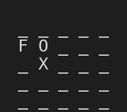
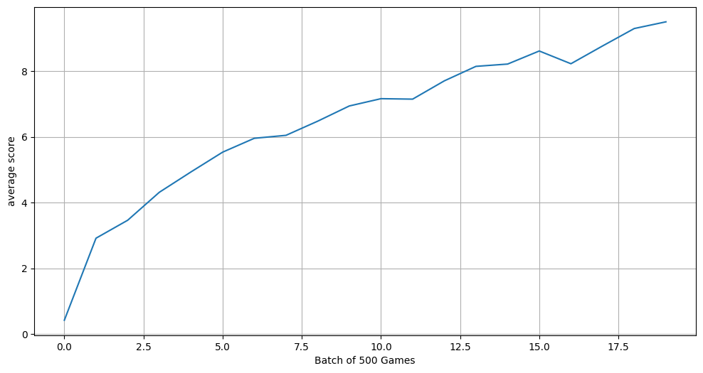
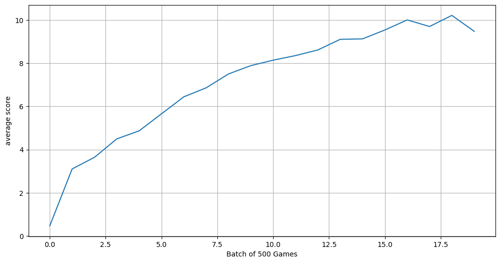
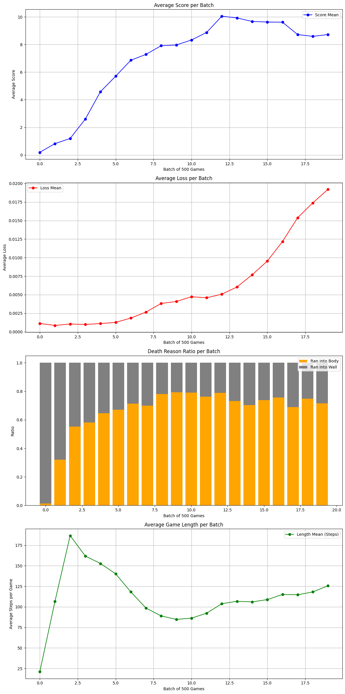

# Snake DQN Agent

## Overview
This project is a reinforcement learning agent that learns to play Snake using Deep Q-Networks (DQN). It started with a simple MLP and evolved into a CNN-based approach to better capture the spatial structure of the game board. The project is still actively being developed, I'm continuously experimenting with different architectures and training strategies.

## Demo


## Training Results

### MLP Agent after 10,000 Games on a 5×5 Board


### CNN Agent after 10,000 Games on a 5×5 Board


### CNN Training Dashboard


The dashboard tracks average score, loss, death reason ratio (wall vs body collision), and average game length across training batches of 500 games.

## Architecture Evolution

### 1. Hand-Crafted Features (MLP with 7 inputs)
The very first version didn't use the full board state at all. Instead, I gave the network 7 hand-crafted binary values:
* 3 danger signals: is there a wall directly to the left, right, or in front of the snake (0 or 1)
* 4 fruit direction signals: is the fruit above, below, to the left, or to the right (0 or 1)

This actually worked surprisingly well. The snake learned to find the fruit consistently and reached decent scores. The problem was that it eventually got stuck in repetitive patterns, following edges and never learning more complex navigation. I didn't record the training graphs for this version unfortunately.

### 2. Full Board State (MLP)
To give the agent more information to work with, I switched to feeding the entire board as a one-hot encoded tensor, flattened into a 1D vector. A 3-layer fully connected network processes this input. This got the agent to an average score of ~9.5 on a 5x5 board after 10,000 games.

### 3. Spatial Awareness (CNN)
To better capture the 2D spatial relationships on the board (where the snake head is relative to the fruit, where the body is, etc.), I switched to a 5-layer CNN. This preserves the grid structure instead of flattening it, and reached a slightly higher average score of ~10 with more stable learning.

The CNN only flattens the state after the convolutional layers:
```
Input (WxHx4) -> 5x [Conv2d -> ReLU] -> Flatten -> Linear -> ReLU -> Linear -> Q-values (3)
```

## State Representation
The board is encoded as a `W × H × 4` tensor using one-hot encoding:

| Channel | Meaning    |
|---------|------------|
| 0       | Empty cell |
| 1       | Snake head |
| 2       | Fruit      |
| 3       | Snake body |

## Action Space
The agent chooses from 3 relative actions: go straight, turn right, or turn left. Using relative rather than absolute directions avoids the agent learning to move backwards into itself.

## Reward Structure
| Event                          | Reward |
|--------------------------------|--------|
| Eating fruit                   | +2.0   |
| Moving closer to fruit         | +0.01  |
| Moving away from fruit         | −0.01  |
| Dying (wall / body / timeout)  | −1.0   |
| Filling the entire board       | +10.0  |

The small Manhattan distance rewards (+0.01 / −0.01) were added because pure sparse rewards (only on eating or dying) made early training extremely slow. The agent had no gradient signal to learn directional movement.

## Training Setup
| Parameter                | Value         |
|--------------------------|---------------|
| Optimizer                | Adam          |
| Learning Rate            | 0.001         |
| Loss Function            | MSE           |
| Discount Factor (γ)      | 0.99          |
| Epsilon (start to min)   | 1.0 to 0.0001 |
| Epsilon Decay            | 0.9995        |
| Replay Memory            | 10,000        |
| Batch Size               | 256           |
| Target Network Update    | Every 512 games |
| Training Frequency (CNN) | Every 4 steps |
| Timeout                  | W × H × 2 steps |

Key techniques:
* **Experience Replay** sampling random mini-batches from a replay buffer to break temporal correlations.
* **Target Network** a separate, periodically-synced copy of the Q-network for stable target values.
* **ε-greedy Exploration** starts fully random and decays toward greedy action selection.

## Observations
* **Death ratio as a learning signal**: Early in training, the agent almost exclusively dies by hitting walls. As it learns, the death ratio shifts toward body collisions, it's surviving long enough to grow and run into itself. This is visible in the dashboard's stacked bar chart.
* **Training frequency matters**: Running `replay()` every 4 steps instead of every step made CNN training significantly faster without hurting performance.
* **MLP vs CNN on small boards**: On a 5×5 board the difference is modest (~9.5 vs ~10 average score), but the CNN should generalize better to larger boards.

## Project Structure
```
Snake_DQN_Agent/
├── environment.py         # Snake game environment
├── agent.py               # AgentMLP and AgentCNN classes
├── q_network_model.py     # QNetworkMLP and QNetworkCNN (PyTorch)
├── train.ipynb            # Training notebook with logging and plots
├── models/                # Saved model weights (.pth)
└── assets/                # Training graphs
```

## Tech Stack
* Python
* PyTorch
* DQN (Deep Q-Network)
* Jupyter Notebook

## How to Run
1. Clone the repository.
2. Install dependencies: `pip install torch matplotlib jupyter`
3. Open `train.ipynb` to train an agent or load a pre-trained model.

## Roadmap
- [ ] Gradient clipping for training stability
- [ ] Larger board sizes (10×10, 15×15)
- [ ] Dueling DQN architecture
- [ ] Prioritized experience replay
- [ ] Hyperparameter sweep / tuning
- [ ] Multi-agent mode: two competing snakes on a single board